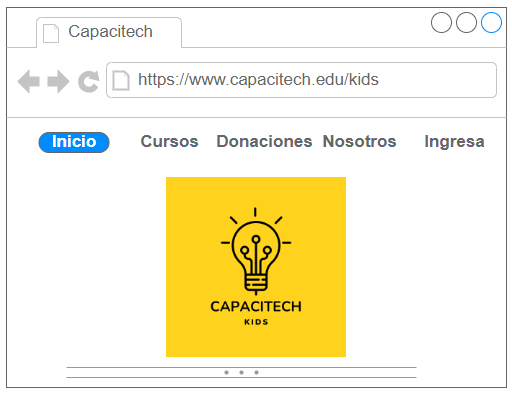
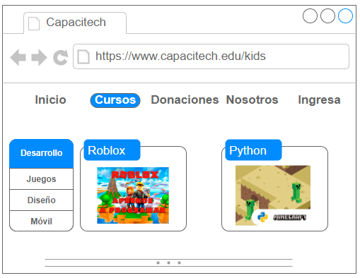
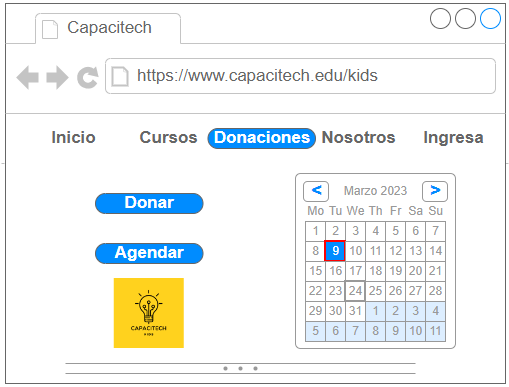
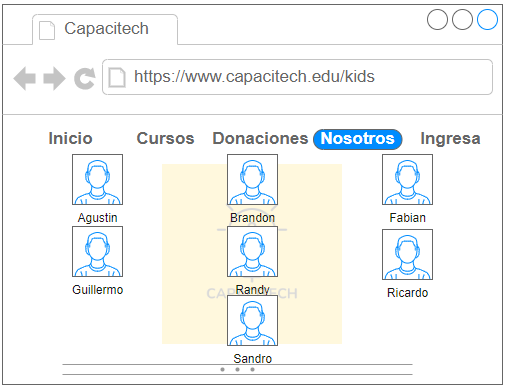
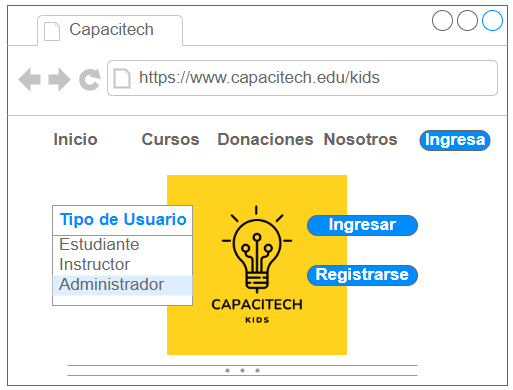

### Presentación

## 
 Repositorio CapaciTechKids para Front-End.

# 💻 Diagrama entidad Relación: 📱
 
    
 

# 🚀 Mockup principales

 
    
Landing page

    
 
    
Cursos

    
 
    
Donaciones

    
 
    
Nosotros

    
 
    
Ingresa

    
 

## Misión

Concentramos nuestros esfuerzos en:
1. Mejorar este proyecto en infraestructura educativa, para aumentar la cobertura, el acceso y la asistencia con mejores habilidades técnicas para el aprendizaje.
2. Desarrollar proyectos que incentiven en los procesos de enseñanza y aprendizaje trabajando de la mano con los docentes para incrementar las expectativas educativas y laborales.

## Visión

Queremos que la próxima generación de latinoamericanos vea en la educación como un vehículo de cambio para soñar, construir y cumplir su proyecto de vida.

# Colaboradores del proyecto:

📌 [Agustin Cristobo](https://github.com/Fr33yr) 

📌 [Brandon Reyes](https://github.com/Brareyesb15)

📌 [Fabián Rizzi](https://github.com/Fabian-Rizzi)

📌 [Guillermo Rodríguez](https://github.com/MemoRodz)

📌 [Randy Gutierrez](https://github.com/Randyvangz)

📌 [Ricardo Ariel Maya](https://github.com/Rickymayita)

📌 [Sandro Malca Neyra](https://github.com/SandroMalca)

# NOTAS:

Este repositorio se crea para el desarrollo del Front correspondiente al Proyecto Final del Grupo 7 de la Cohorte 33c.